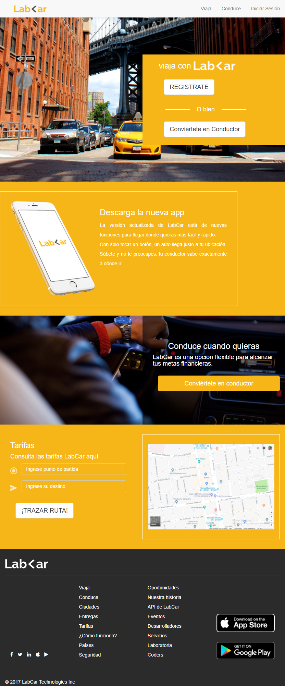
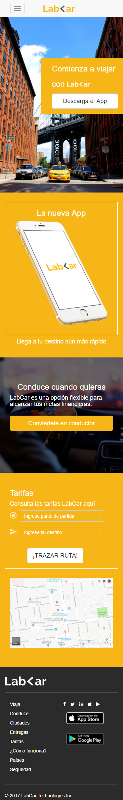
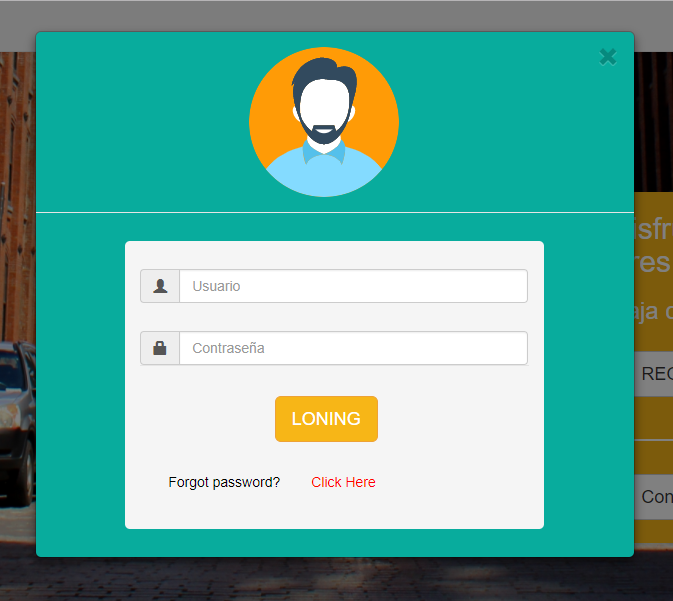
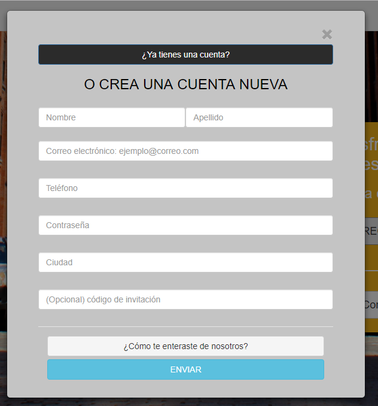
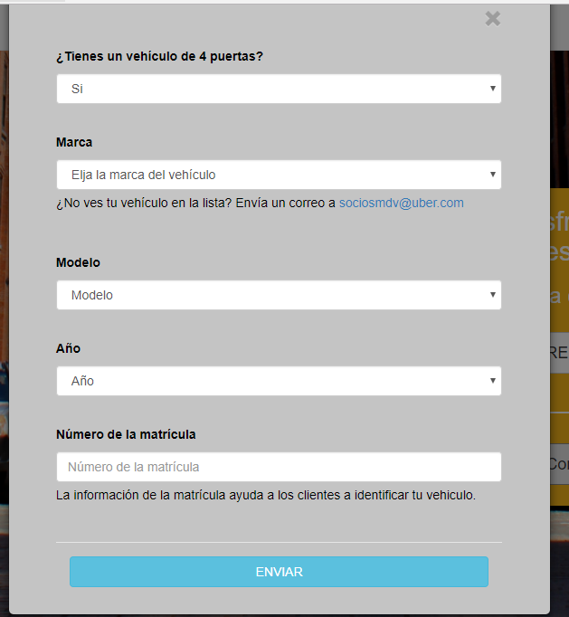

# LabCar
LabCard es un proyecto basado en ofrecer el servicio de taxi, además de ser un página responsive, que hace uso del framework CSS de bootstrap. Permite obtener el costo y tiempo de llegada del cliente.

## Desarrollado para [Laboratoria](http://www.laboratoria.la/)

### Lab>ar Tablet: 

### Lab>ar Movil: 

***

## Modales: 

### Modal-Login

### Modal-Registro

### Modal-Registro-Conductor

***
